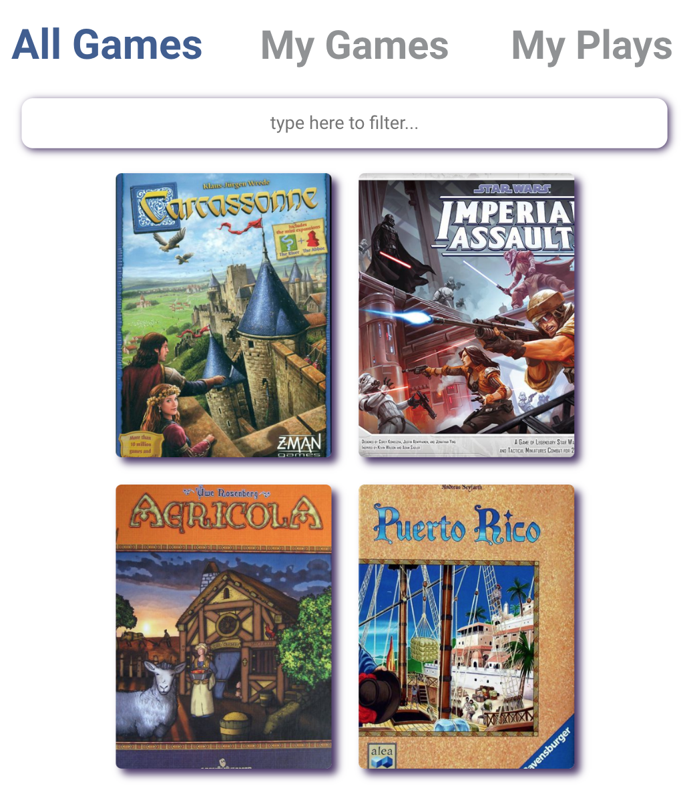
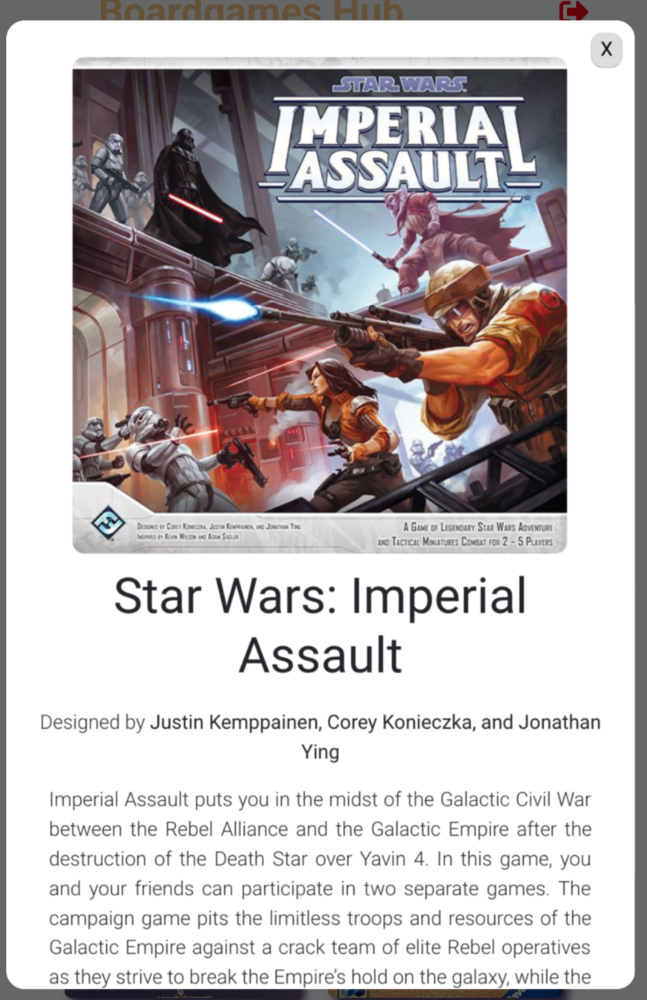
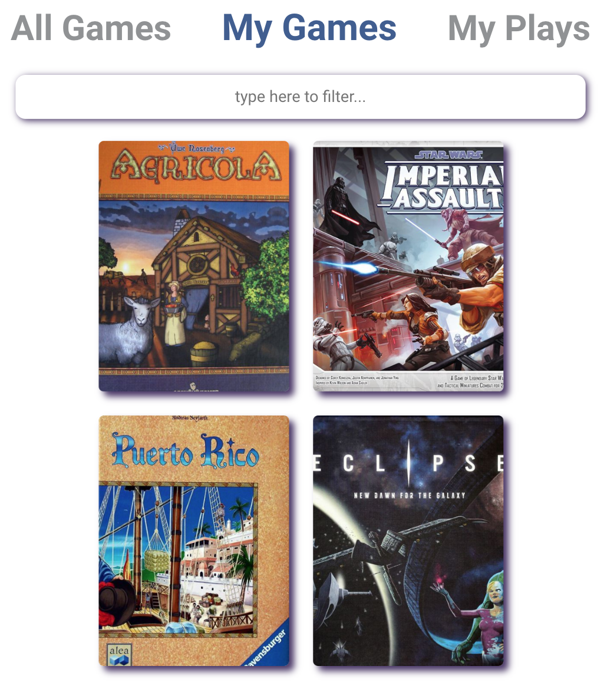
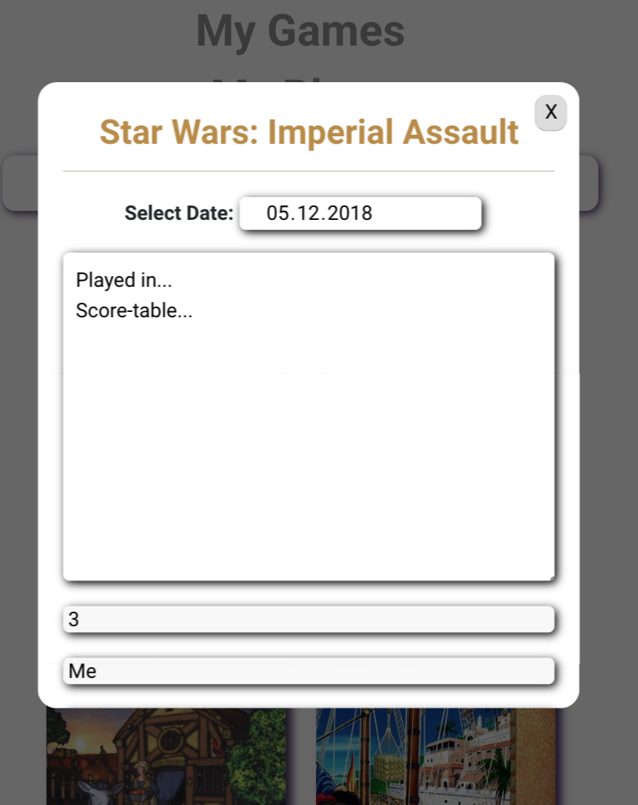
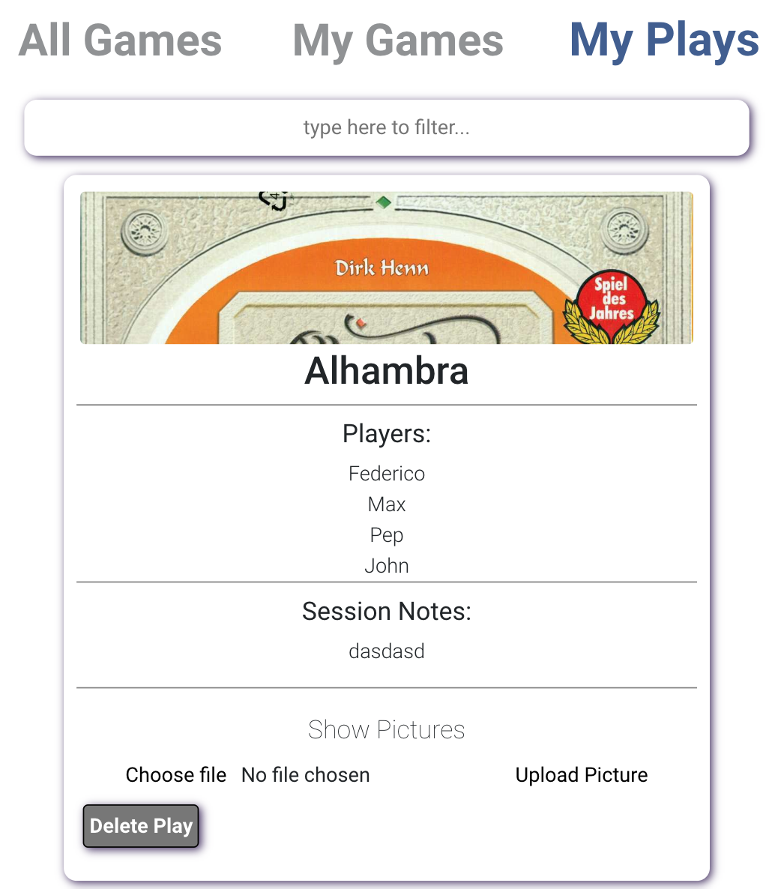

# Boardgames Hub

Boardgames Hub is a platform that allows geeks from all over the net to easily discover new games, manage their games collection and register their own game sessions.

Live demo: xxxx

[View the documentation](./doc/README.md)

# Screenshots
## Discover new games you will love


## Consult more information about a given game



## Manage your own ollection


## Register a game session 


## Check your gameplays


# Instructions

Server

```bash
$ cd server
$ npm i
$ npm run build
$ node .
```

Client

```bash
$ cd client
$ npm i
$ npm run build
$ npm start
```

# Author

Federico Gomez Cucchiararo https://github.com/fedeCucchiararo